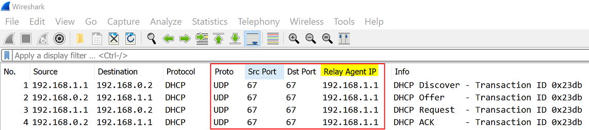
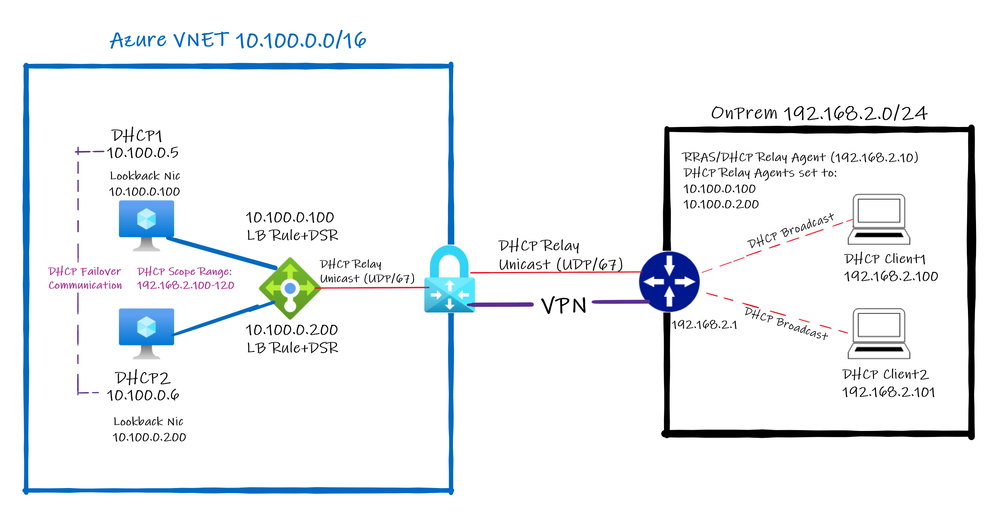
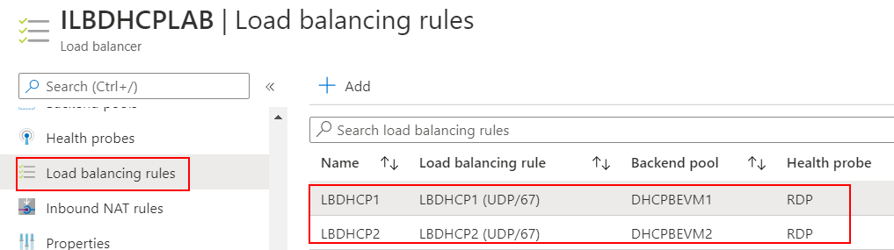
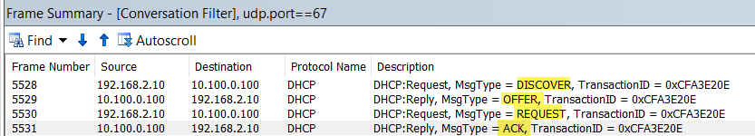
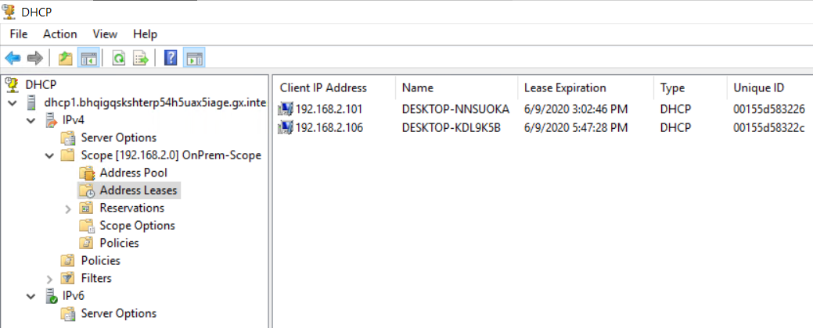
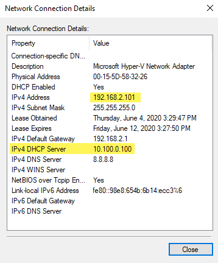

# Running DHCP Server on Azure VM

Proof of Concept on how to run Windows DHCP Servers on Azure to assign dynamic IPs to On-Prem networks.

***
**DISCLAIMER**: This solution is currently not supported by Microsoft. It should be used only as proof of concept.
***

## Introduction

This is a brief guide on how to make DHCP Server running on Windows Server to provide dynamic IP for **DHCP Relay Agent** requests from OnPremises Networks.

It is important to mention the fact Windows DHCP Server role at this time is not supported on based on KB [2721672](https://support.microsoft.com/en-us/help/2721672/microsoft-server-software-support-for-microsoft-azure-virtual-machines).

On Azure Virtual Network broadcast packets does not work by design but the intention of this guide is to show the DHCP Relay feature which relies exclusively on unicast UDP packets on port 67. Here is a highlight from official Azure configuration: [What protocols can I use within VNets?](https://docs.microsoft.com/en-us/azure/virtual-network/virtual-networks-faq#what-protocols-can-i-use-within-vnets)

_You can use TCP, UDP, and ICMP TCP/IP protocols within VNets. Unicast is supported within VNets, with the **exception of Dynamic Host Configuration Protocol (DHCP) via Unicast (source port UDP/68 / destination port UDP/67)** and UDP source port 65330 which is reserved for the host. Multicast, broadcast, IP-in-IP encapsulated packets, and Generic Routing Encapsulation (GRE) packets are blocked within VNets._

**Update: Sept/2021** - There's also a DHCP throttling inside Azure platform specifically targeting DHCP requests and responses packets which also makes this solution not scalable. It is recommended opening a support ticket with Azure Support team to get more details.

## DHCP Relay Overview

DHCP Relay Agent traffic has UDP using  source and destination port on 67 (same port, which is different from the remark of Azure VNET documentation above which says source UDP 68 and destination UDP 67). That DHCP relay traffic has been confirmed per capture sample below and also reviewed [RFC 8357](https://tools.ietf.org/html/rfc8357#section-3) under section 3.

    # Below is what RFC describes regular DHCP Client to Server Ports. 
    # That is Azure Virtual Network traffic limitation for DHCP documentation refers to:
    
    DHCP uses UDP as its transport protocol.  DHCP messages from a client
    to a  server are sent to the 'DHCP server' port (67), and DHCP messages
    from a server to a client are sent to the 'DHCP client' port (68).
    
    # Here is the portion of the RFC that describes how DHCP relay agent works:
    
    Relay agents implementing this specification may be configured instead to 
    1) use a source port number other than 67 when relaying messages toward servers and 
    2) receive responses toward clients on that same port. 

That behavior is confirmed via a network capture, traffic is unicast UDP on port 67 (Source and Destination) between Relay Agent (192.168.1.1) and DHCP Server (192.168.0.2) illustrated below:

## Solution design

Here is an illustration of the LAB setup and traffic flow:

### OnPrem side (192.168.2.0/24)

- On-Prem side has to be done either on physical network or Hyper-V (It can be on Azure Hosted VM in Azure as well). Inside Hyper-V a VM with PFSense and two NICs (One NIC to External able to reach Internet and another to Hyper-V Internal).

- Internal Hyper-V Network behind Pfsense incudes two Windows 10 VMs.  
- Configured DHCP Relay Agent (using RRAS) on Hyper-V Host to use 10.100.0.100 and 10.100.0.200.
    - Hyper-V Host has a NIC with IP 192.169.2.10 to receive broadcast DHCP requests and forward them to defined DHCP Server (10.100.0.100 and 10.100.0.200).
    Note: that has to be done because Relay Agent on PFSense does not support send traffic when destination are over an IPSec Interface (more info to be added here).
- Configure IPSec Tunnel between PFSense with S2S VPN (BGP Enabled) to Azure VPN Gateway (it can be done with static routing as well).

### Azure Side (10.100.0.0/16)

- Configure Azure VPN GW to terminate S2S VPN to OnPrem Pfsense. 
- Single VNET with two Azure Windows Server VMs named DHCP1 and DHCP2.
- Installed DHCP Role but DHCP service only runs when Windows has Static IP address (see details on [Considerations running DHCP Server on Azure VM](#considerations-running-dhcp-server-on-azure-vm) )
    - To workaround that install MS Loopback Interface and set IPs 10.100.0.100 on DHCP1 and 10.100.0.200 on DHCP2.
    More info on how to install MS Loopback see KB [842561](https://support.microsoft.com/en-us/help/842561/) (use Method 2)
    - Enable weakhostreceive and weakhostsend both local and loopback interfaces to allow traffic be routed between local interface connected to Azure VNET and MS Loopback interface. Example:

            #Dump interface ID
            C:\>netsh int ipv4 show int

                Idx     Met         MTU          State                Name
                ---  ----------  ----------  ------------  ---------------------------
                1          75    4294967295  connected     Loopback Pseudo-Interface 1
                2          10        1500    connected     Ethernet
                24         25        1500    connected     Ethernet 14
            
            # Enable weakhostreceive and weakhostsend on Ethernet Idx 2 - Primary interface (Azure DHCP Client)
            C:\>netsh int ipv4 set int 2  weakhostreceive=enabled weakhostsend=enabled
            
            # Enable weakhostreceive and weakhostsend on Ethernet Idx 24 - Microsoft Loopback Adapter
            C:\>netsh int ipv4 set int 24  weakhostreceive=enabled weakhostsend=enabled
            # Note: Don't get confused with Loopback Pseudo-Interface and MS Loopback Interface.

- Configured Standard Internal Load Balancer (**ILB**) and added DHCP1 and DHCP2 as backends:
    - Configured two Front End IPs same used on Loopbacks of DHCP1 and DHCP2: 10.100.0.100 and 10.100.0.200.
    - Configured ILB Probe to TCP 3389 (3389)
    - First LB Rule using Frontend IP 10.100.0.100, Protocol UDP, Port 67, Backend Port: 67, Backend Pool: DHCP1, Health Probe TCP 3389 and Floating IP (direct server return) Enabled
    - Second LB Rule using Frontend IP 10.100.0.200, Protocol UDP, Port 67, Backend Port: 67, Backend Pool: DHCP2, Health Probe TCP 3389 and Floating IP (direct server return) enabled
            

### End result

Below are the outcome of the setup:

1. Full  DHCP DORA between Relay Agent and DHCP Server running on Azure VM:

2. DHCP Server shows lease:

 

3. End result on Windows 10 client side:

 

## Considerations running DHCP Server on Azure VM

There is a special consideration to make DHCP Server to run properly on a Azure Windows VM. First, I validated UDP traffic from my home DHCP Relay Agent hosted in Hyper-V would correctly arrive at Azure VM before spending time configuring DHCP Server side. Here is frame capture on Azure side (10.100.0.5) from the Relay Agent DISCOVERY request (192.168.2.10).
 
    192.168.2.10    10.100.0.5    DHCP    DHCP:Request, MsgType = DISCOVER, TransactionID = 0xDE0A1442
     Ipv4: Src = 192.168.2.10, Dest = 10.100.0.5, Next Protocol = UDP, Packet ID = 2100, Total IP Length = 328
     Udp: SrcPort = BOOTP server(67), DstPort = BOOTP server(67), Length = 308
     Dhcp: Request, MsgType = DISCOVER, TransactionID = 0xDE0A1442
 
10.100.0.5 is Azure VM running Windows Server 2016 but no DHCP Server at this time. 

Main issue found: DHCP Server can be installed fine but it will not run on a Azure VM because it will not listed on interfaces that are using dynamic IP aka DHCP clients. Event Viewer shows:

    Error    3/7/2020 1:00:29 PM    DHCP-Server    1041 
    The DHCP service is not servicing any DHCPv4 clients because none of the active network 
    interfaces have statically configured IPv4 addresses, or there are no active interfaces.

Ok, we need a static IP on the VM and the only way to get that is adding a Loopback Adapter. I added IP 10.100.0.100 on that NIC. No more error on DHCP after restart the service and just to make sure checked netstat and UDP 67 was correctly listening on 10.100.0.100. I repeated the same process for DHCP2 (10.100.0.200).
